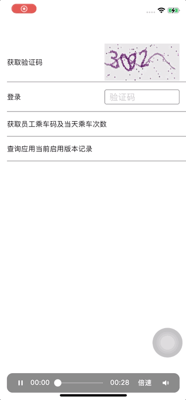

# DebugCenter(调试工具)

##  Features

功能:
1.输出不同类型的日志
2.爬去网络请求数据
3.日志筛选
4.日志的导出
5.日志复制
6.查看历史日志
7.搜索日志
8.清空日志
9.查看沙盒文件

##  Preview

<p align="center">
  
</p>

##  Usage

这是一个app的调试工具, 那张使用之后通过点击屏幕三下,唤起日志页面查看输出的日志,网络的请求输出的数据通过爬虫方式获取,不需要写任何第三方代码自动获取.日志可以进行筛选,复制,导出,删除,也可以查看沙盒中的文件,文件支持多种文件格式的浏览,例如: doc,gif,heic,jpeg,jpg,json,log,mp3,mp4,pdf,plist文件浏览,

##  Installation 
```swift
  pod 'DebugCenter', '~> 1.3.0' 
```

## Use
安装之后在AppDelegate先启动

```swift
        FHXDebugCenter.start()
```

然后需要输出的地方写入代码
```swift
    FHXLog.shared.log("日志")
    FHXLog.shared.log("日志", .crash)
    FHXLog.shared.log("日志", .error)
    FHXLog.shared.log("日志", .debug)
```

## Demol

```swift
import UIKit
import DebugCenter

@main
class AppDelegate: UIResponder, UIApplicationDelegate {

    var window: UIWindow?

    func application(_ application: UIApplication, didFinishLaunchingWithOptions launchOptions: [UIApplication.LaunchOptionsKey: Any]?) -> Bool {
        
        window = UIWindow.init(frame: UIScreen.main.bounds)
        window?.rootViewController = UINavigationController(rootViewController: LoginViewController())
        window?.makeKeyAndVisible()
        
        FHXDebugCenter.start()
        return true
    }
    
}
```

```swift
import UIKit
import DebugCenter

class ViewController: UIViewController {
    
    
    override func viewDidLoad() {
        super.viewDidLoad()
        view.backgroundColor = .white
        
        FHXLog("日志")
        
        FHXLog("请求失败", .error)
        
        FHXLog.shared.log("123", .crash)
        
    }
 
}

```
